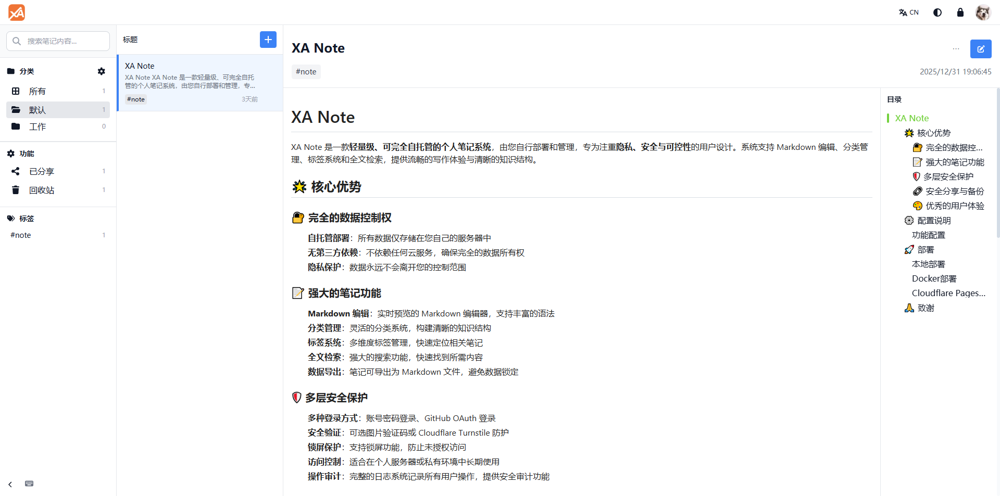

中文 | [English](README_EN.md)

# XA Note

XA Note 是一款**轻量级、可完全自托管的个人笔记系统**，由您自行部署和管理，专为注重**隐私、安全与可控性**的用户设计。系统支持 Markdown 编辑、分类管理、标签系统和全文检索，提供流畅的写作体验与清晰的知识结构。

作者博客：[https://www.xiaoa.me](https://www.xiaoa.me)

如果项目对你有所帮助，麻烦给个 `Star` 。



## 🌟 核心优势

### 🔐 完全的数据控制权
- **自托管部署**：所有数据仅存储在您自己的服务器中
- **无第三方依赖**：不依赖任何云服务，确保完全的数据所有权
- **隐私保护**：数据永远不会离开您的控制范围

### 📝 强大的笔记功能
- **Markdown 编辑**：实时预览的 Markdown 编辑器，支持丰富的语法
- **分类管理**：灵活的分类系统，构建清晰的知识结构
- **标签系统**：多维度标签管理，快速定位相关笔记
- **全文检索**：强大的搜索功能，快速找到所需内容
- **数据导出**：笔记可导出为 Markdown 文件，避免数据锁定

### 🛡️ 多层安全保护
- **多种登录方式**：账号密码登录、GitHub OAuth 登录（不支持Cloudflare Pages）
- **安全验证**：可选图片验证码或 Cloudflare Turnstile 防护
- **锁屏保护**：支持锁屏功能，防止未授权访问
- **访问控制**：适合在个人服务器或私有环境中长期使用
- **操作审计**：完整的日志系统记录所有用户操作，提供安全审计功能

### 🔗 安全分享与备份
- **只读分享**：支持笔记分享，可设置访问密码与过期时间控制
- **WebDAV 备份**：与云存储或私有 NAS 集成，实现数据自动同步（不支持Cloudflare Pages）
- **长期保存**：多种备份方式确保数据安全

### 🎨 优秀的用户体验
- **响应式设计**：在桌面和移动设备上均可获得良好体验
- **主题切换**：支持深色/浅色主题切换
- **多语言支持**：中英文界面无缝切换
- **键盘快捷键**：提高操作效率
- **系统监控**：内置日志管理系统，支持操作记录查看和过滤

## 🚀 快速部署指南

### 方法一：Cloudflare部署

#### 步骤 1: Fock 本项目
`Fock` 本项目同时请帮忙点个 `Star`

#### 步骤 2: 创建 D1 数据库
手动创建 D1 数据库，数据库名：`xa-note-db`

*或* 脚本创建：
```bash
# 创建 D1 数据库
wrangler d1 create xa-note-db
```

#### 步骤 3: 导入数据表结构
手动复制 `d1-init.sql` (*6张表*) 在 D1 数据库控制台导入 

*或* 脚本导入：
```bash
# 使用架构和默认数据初始化数据库
wrangler d1 execute xa-note-db --file=d1-init.sql
```

#### 步骤 4: 创建项目
1. 前往 **Cloudflare 控制台** > **Pages** > **创建项目**
2. 连接你的 Git 仓库
3. 配置 **构建设置**：
   - **框架预设**: `None`
   - **构建命令**: `npm install`
   - **构建输出目录**: `.`（当前目录）
   - **根目录**: `/`（仓库根目录）
   - **Node.js 版本**: `18` 或更高

#### 步骤 5: 配置环境变量（控制台）
1. 前往 **Cloudflare 控制台** > **Pages** > **xa-note**
2. 导航到 **设置** > **环境变量**
3. 添加 **生产环境** 变量（可选）：
   - `JWT_SECRET`: 你的安全 JWT 密钥（32+ 字符）
   - `NODE_ENV`: `production`
4. 前往 **设置** > **Functions**
5. 添加 **D1 数据库绑定**：
   - **变量名**: `DB`
   - **D1 数据库**: `xa-note-db`
6. 导航到 **部署** > **所有部署**，最新的部署... `重试部署`（d1数据库绑定后必须重新部署）


#### 步骤 6: 部署后操作

1. **访问你的站点**: `https://your-project.pages.dev` 或绑定你自己的域名
2. **完成设置**: 按照安装向导操作
3. **开始使用**: 创建你的第一个笔记！

---

### 方法二：Docker部署

#### **一键部署**
```bash
# 拉取镜像
docker pull awinds/xa-note:latest

mkdir -p /var/xa-note/data

# 运行容器
docker run -d \
  --name xa-note \
  -p 9915:9915 \
  -v /var/xa-note/data:/app/data \
  -e NODE_ENV=production \
  -e PORT=9915 \
  --restart unless-stopped \
  awinds/xa-note:latest
```
#### **Docker Compose部署**
```
# docker-compose.yml
version: "3.9"

services:
  xa-note:
    image: awinds/xa-note:latest
    container_name: xa-note
    ports:
      - "9915:9915"
    volumes:
      - /var/xa-note/data:/app/data
    environment:
      NODE_ENV: production
      PORT: 9915
    restart: unless-stopped
```
#### **nginx反代**
```
server {
    listen 443 ssl;
    server_name your-domain.com;
    
    location / {
        proxy_pass http://localhost:9915;
        proxy_set_header Host $host;
        proxy_set_header X-Real-IP $remote_addr;
    }
}
```


## 📄 许可证

本项目采用 MIT 许可证。

## 🙏 致谢

感谢所有开源项目的贡献者，XA Note 使用了以下优秀的开源项目：

- React - 用户界面库
- TypeScript - 类型安全的 JavaScript
- Vite - 现代化的构建工具
- Hono - 轻量级 Web 框架
- Tailwind CSS - 实用优先的 CSS 框架
- SQLite - 嵌入式数据库

---

**XA Note** - 轻量级自托管笔记系统，您的个人知识管理伙伴 🚀
